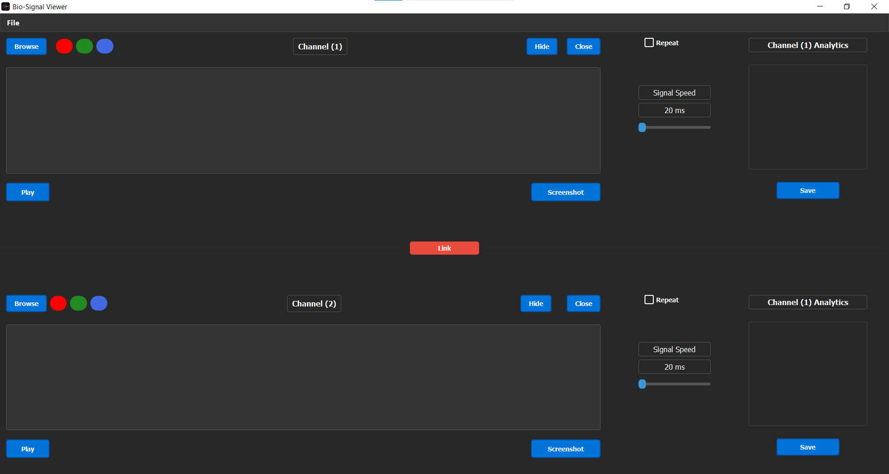

# Signal Viewer Application

## Overview

The Signal Viewer is a desktop application designed to visualize biological signals. Utilizing PyQt5 for its GUI and incorporating functionalities such as playback and real-time updates, it serves as a versatile tool for researchers and professionals working with biological signals like ECG.



## Features

- **Signal Visualization:** View biological signals effectively in a clean and user-friendly interface.
- **File Import:** Import signal data from `.dat`, `.csv` files.
- **Playback Controls:** Play and pause the visualization to understand signal variations and anomalies over time.
- **Hide/Show:** Ability to toggle the visibility of the signals for comparative studies.
- **Screenshot:** Snapshot feature to capture and save the visualized signals as images.
- **Color Toggling:** Customize the color of the signal for clear visibility and understanding.
  
## Getting Started

### Prerequisites

- Python 3.x
- wfdb
- numpy
- pandas
- PyQt5
- pyqtgraph
- reportlab
- pyqt5-tools


### Installation

1. **Clone the Repository**

   ```shell
   git clone [https://github.com/fadymohsen/SignalViewer]
   cd [SignalViewer]
   ```

2. **Install Dependencies & Requirements**

   ```shell
   pip install -r requirements.txt #All Libraries & Packages
   ```

3. **Run the Application**

   ```shell
   python main.py
   ```

## How to Use

1. **Load Signal:**
    - Click on `Browse` and choose your signal file (.dat or .csv format).
    - View the signal in the respective channel panel.
  
2. **Playback:**
    - Use the `Play/Pause` button to start or stop the signal visualization playback.
  
3. **Hide/Show Signal:**
    - Use the `Hide` button to toggle the visibility of the signals in each channel.
  
4. **Screenshot:**
    - Use the `Screenshot` button to save a snapshot of the current view of the signal.
  
5. **Change Signal Color:**
    - Utilize the color buttons (e.g., Red, Green, Blue) to toggle the color of the visualized signals.
  
6. **Close:**
    - Click the `Close` button to end the signal visualization in a particular channel.
  
7. **Export:**
   - functionality to save the visualized data in various formats.

8. **Zoom:**
   - Zoom in or out in the signal view.

## Development

### Structure

- **Signal Viewer:** The primary GUI application class responsible for handling user inputs and managing UI updates.
- **Signal:** A class dedicated to managing and manipulating signal data, rendering, and controlling playback.

### Libraries

- **PyQt5:** Handles GUI creation, management, and user interaction.
- **pyqtgraph:** Enables real-time signal graphing.
- **wfdb:** Used for loading, writing, and processing WFDB signals and annotations.
- **NumPy and pandas:** Manage numerical operations and data management.
---

## Team Members: <br>
1- Fady Mohsen <br>
2- Ahmad Mahmoud <br>
3- Shehab Mohamad <br>
4- Mohamad Aziz <br>
